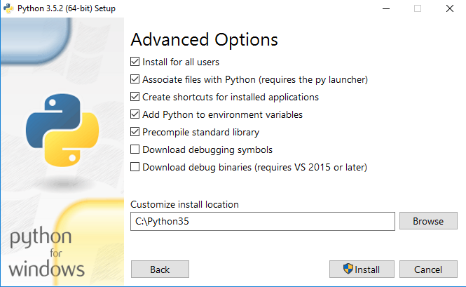

# ইনস্টলেশন

আপনি যদি লিনাক্স বা ম্যাক ব্যবহারকারী হন তবে আপনার কম্পিউটারে পাইথন দেওয়াই থাকে। এই কোর্স লেখা পর্যন্ত \(জুলাই ২০১৬\) এই মেজর দুটি অপারেটিং সিস্টেমের সাথে যে পাইথন বিল্ট ইন অবস্থায় ডিফল্ট হিসেবে থাকে তার ভার্সন হচ্ছে `Python 2.7.x`. কিন্তু, এই কোর্সটি লেখা হচ্ছে `Python 3.5.x` এর উপর ভিত্তি করে। আসলে পাইথন ২ এবং ৩ ভার্সনের মধ্যে সিনট্যাক্স এবং ফিচার সম্পর্কিত বেশ কিছু মাঝারি মানের পরিবর্তন আছে। পাইথনের অফিসিয়াল সাইটে বর্তমানে পাইথন ৩ কেই বেশি ফোকাস করা হয়ে থাকে এবং তারা স্পষ্টই বলে দিয়েছে যে পাইথনের বর্তমান এবং ভবিষ্যৎ হচ্ছে **পাইথন ৩**

> Python 2.x is legacy, Python 3.x is the present and future of the language

**পাইথন ২ আর পাইথন ৩ এর পার্থক্য কি?**  
পাইথনের এই দুটি প্রধান ভার্সনের মধ্যেকার পার্থক্য এবং আরও বিস্তারিত জানতে পড়া যেতে পারে অফিসিয়াল [এই পোস্টটি](https://wiki.python.org/moin/Python2orPython3)

## ইন্সটলেশন

আমরা নিচে কিছু মেজর অপারেটিং সিস্টেমে পাইথন ৩ এর লেটেস্ট ভার্সন ইন্সটলেশনের ধাপ গুলো সম্বন্ধে জানবো। আগেই বলা হয়েছে, লিনাক্স বা ম্যাকে পাইথনের ২ ভার্সন বিল্ট-ইন অবস্থায় থাকে। তাই সরাসরি এই পাইথনের ইন্টারপ্রেটারকে চালু করতে হলে টার্মিনাল ওপেন করে কমান্ড লিখতে হবে,

```bash
python
```

এবং এন্টার চাপলেই পাইথন ২ এর ইন্টারপ্রেটার চালু হবে। কিন্তু আমরা এই ভার্সন নিয়ে যেহেতু কাজ করবো না তাই নিচের লেটেস্ট ভার্সন ইন্সটলেশনের দিকে মনোযোগ দেই।

**লিনাক্স \(উবুন্টু\)**  
উবুন্টুর লেটেস্ট ভার্সনে `Python 3` কেও ইন্সটল্ড অবস্থায় দেখা যায় \(যেমন Python 3.4.2\) কিন্তু ডিফল্ট হিসেবে সেট করা থাকে না। অর্থাৎ, এই ভার্সনের ইন্টারপ্রেটার চালু করতে টার্মিনালে লিখতে হতে পারে `python3` এবং এন্টার চাপতে হবে।

> দুটি পাইথনের আলাদা আলাদা বাইনারি আলাদা নামে সেইভ থাকে এবং এদের পাথও দেখা যেতে পারে। টার্মিনালে যথাক্রমে `which python` এবং `which python3` কমান্ড ইস্যু করলে যথাক্রমে `/usr/bin/python` এবং `/usr/local/bin/python3` দেখা যাবে। অর্থাৎ ডিফল্ট পাইথন এবং পাইথন 3.4 এর পাথ আলাদা।

যাই হোক, আমরা যদি আরও লেটেস্ট ভার্সনটিকে ইন্সটল করতে চাই তাহলে সরাসরি [এই লিঙ্ক](https://www.python.org/ftp/python/3.5.2/Python-3.5.2.tgz) থেকে পাইথন 3.5.2 এর Gzipped source tarball ডাউনলোড করে সেটিকে Extract করে নিতে হবে। এতে করে কম্পিউটারে Python-3.5.2 নামের একটি ফোল্ডার তৈরি হবে।

এবার, টার্মিনাল ওপেন করে `cd` কমান্ড ব্যবহার করে ওই ফোল্ডারের লোকেশনে যেতে হবে। যেমন,

```bash
$ cd ~/Downloads/Python-3.5.2
```

এরপর নিচের কমান্ডটি দিতে হবে,

```bash
./configure
```

এখন নিচের কমান্ডটি দিন,

```bash
make
```

এরপর,

```bash
sudo make install
```

সব কিছু ভালোয় ভালোয় হয়ে গেলে টার্মিনাল ওপেন করে কমান্ড দিন,

```bash
python3.5
```

নিচের মত আউটপুট আসবে,

```bash
Python 3.5.2 (default, Jul 22 2016, 18:23:14)
[GCC 4.8.2] on linux
Type "help", "copyright", "credits" or "license" for more information.
>>>
```

অর্থাৎ Python 3.5.2 এর কনসোল বা REPL চালু হয়ে গেছে :\)

> এই নতুন পাইথনের লোকেশন জানতে `which python3.5` কমান্ড দিয়ে দেখতে পারেন যার আউটপুট আসতে পারে `/usr/local/bin/python3.5`

  
 **ম্যাক ওএসএক্স**  
লিনাক্সের মত ম্যাকেও পাইথন ২ বিল্ট ইন অবস্থায় থাকে। পাইথনের লেটেস্ট ভার্সনটির .pkg ফরম্যাট ডাউনলোড করতে হবে [এখানে থেকে](https://www.python.org/ftp/python/3.5.2/python-3.5.2-macosx10.6.pkg).

এরপর ডাউনলোড করা ফাইলে ডাবল ক্লিক করে এবং স্ক্রিনে আগত তথ্য গুলো দেখে দেখে খুব সহজেই গ্রাফিক্যাল মুডে পাইথন ইন্সটল করা যায়।

ইন্সটলেশন কমপ্লিট হলে নতুন পাইথনের পাথ কে সিস্টেমের PATH এনভায়রনমেন্ট ভ্যারিয়েবলে যুক্ত করে নিতে হবে। এ জন্য আপনার ব্যবহৃত শেল প্রোগ্রামের উপর ভিত্তি করে `~/.profile`, `.zshrc`, অথবা `~/.bash_profile` ফাইলকে এডিট করে নিচের লাইনটি জুড়ে দিন।

```bash
export PATH=$PATH:/Library/Frameworks/Python.framework/Versions/3.5/bin/python3
```

এখন নতুন একটি টার্মিনাল উইন্ডো ওপেন করে কমান্ড দিন,

```python
python3
```

নিচের মত আউটপুট তথা REPL চালু হলে ধরে নেয়া যায় পাইথনের লেটেস্ট ভার্সন ইন্সটল হয়েছে,

```bash
Python 3.5.1 (v3.5.1:37a07cee5969, Dec  5 2015, 21:12:44)
[GCC 4.2.1 (Apple Inc. build 5666) (dot 3)] on darwin
Type "help", "copyright", "credits" or "license" for more information.
>>>
```

ম্যাকে পাইথন ইন্সটল করার সাথে সাথে একটি IDLE \(Integrated Development Environment\) -ও ইন্সটল হয়ে যায় যেটা আসলে টার্মিনালের পাইথন REPL \(read–eval–print loop\) এর মতই কাজ করে কিন্তু বিশেষভাবে পাইথন প্রোগ্রামিং এর জন্যই তৈরি। অ্যাপ লিস্ট থেকে এই নতুন ইন্সটল হওয়া REPL কে খুঁজে চালু করা যাবে।

**সাবধানতা**  
যেহেতু লিনাক্স ও ম্যাকে পাইথন ২ এর বাইনারি বিল্ট-ইন থাকে এবং আলাদাভাবে ইন্সটল করা পাইথন এর বাইনারির নাম সাধারণত `python3.4` বা `python3.5` হয়ে থাকে; তো অনেকেই নতুন ইন্সটল করা পাইথন বাইনারির নাম বদলে বা সিম্বোলিক লিঙ্ক তৈরি করে `python` করে থাকেন যাতে করে টার্মিনালে `python` কমান্ড এক্সিকিউট করলেই পাইথন ৩ এর ইন্টারপ্রেটার চালু হয়। **এই কাজটি করা একদম উচিৎ না।** কারণ লিনাক্স বা ম্যাকে কিছু টুলস এবং প্রোগ্রাম থাকে যেগুলো ওই সিস্টেমের পাইথন এর উপরেই নির্ভর করে। এখন যখন আপনি পাইথন ৩ এর নাম বদলে শুধু পাইথন করে দিবেন, তারপর থেকে ওই সিস্টেম প্রোগ্রাম গুলো হয়তো সঠিক ভাবে কাজ করবে না। কারন তারা পাইথন ২ এর ইন্টারপ্রেটার কে চেনে পাইথন নামে।

> এসব ছোট জটিলতা সমাধান করা যায় ভার্চুয়াল এনভায়রনমেন্ট তৈরির মাধ্যমে যা কোর্সের শেষের দিকে আলোচনা করা হবে।

**উইন্ডোজ**  
এই অপারেটিং সিস্টেমে বিল্ট-ইন পাইথন না থাকায় অবশ্যই আলাদা ভাবে ইন্সটল করে নিতে হবে। প্রথমে [এখান থেকে](https://www.python.org/ftp/python/3.5.2/python-3.5.2-amd64.exe) ৬৪ বিট উইন্ডোজের জন্য অথবা [এখান থেকে](https://www.python.org/ftp/python/3.5.2/python-3.5.2.exe) ৩২ বিট উইন্ডোজের জন্য ইন্সটলার ডাউনলোড করে নিন। ম্যাক এর ইন্সটলারের মতই উইন্ডোজ এর জন্য ইন্সটলারটিও গ্রাফিক্যাল ইন্টারফেস ভিত্তিক অর্থাৎ, মাউস এর কয়েকটি ক্লিক দিয়েই পাইথন ইন্সটল করে নিতে পারেন।

ইন্সটলারটি ওপেন হলে 'customize installation' সিলেক্ট করুন। তারপরে 'Optional features' স্ক্রিনে সবগুলো চেকবক্সই সিলেক্টেড রেখে দিতে পারেন। তারপরে 'Advanced option' স্ক্রিন থেকে প্রয়োজনীয় চেকবক্সগুলো সিলেক্ট করে দিন \(বিশেষ করে 'Install for all users', 'Add python to environment variables' এবং 'Precompile standard library'\)।



এখান থেকে আপনি পাইথনের ইন্সটলেশন লোকেশনও চেঞ্জ করে দিতে পারেন। সাধারণত সবাই ইন্সটলেশন লোকেশন হিসেবে `C:\Python3x` ব্যবহার করে থাকে। এরপরে 'Install' বাটন চেপে ইন্সটলেশন কমপ্লিট করুন।

এই ইন্সটলেশনেও একটি গ্রাফিক্যাল পাইথন কনসোল প্রোগ্রাম ইন্সটল হয়ে যায় যাকে আমরা IDLE বলছি। Start মেনু থেকে All Programs এর মধ্যে Python 3.5 নামক ফোল্ডারের মধ্যে IDLE নামের প্রোগ্রামটি থাকবে যেখান থেকে একে চালু করা যেতে পারে।

যদি আপনি উপরের মত করে ইন্সটলেশনে 'Add python to environment variables' অপশন সিলেক্ট করে থাকেন তাহলে আপনি উইন্ডোজের ডিফল্ট কমান্ড প্রম্পট প্রোগ্রামের মধ্যেই পাইথন ইন্টারপ্রেটার ব্যবহার করতে পারবেন \(লিনাক্স বা ম্যাকের টার্মিনালের মত করে\)।

আর যদি না করে থাকেন তাহলে পাইথন ডিরেক্টরীকে সিস্টেম পাথে যোগ করে নিন । অর্থাৎ `C:\Python3x` \(ধরে নিচ্ছি আপনার পাইথন ইন্সটলেশন সি ড্রাইভের মধ্যেই করেছেন\) এই লোকেশনটিকে আপনার `PATH` ভ্যারিয়েবলে যোগ করে নিন।

নীচের মত করেঃ

* `My Computer` এর উপর রাইট ক্লিক করে `Properties` এ যান ।
* বাম পাশে `Advanced System Settings` এ ক্লিক করূন ।
* নিচের দিকে থাকা `Environment Variables` এ ক্লিক করুন ।
* `System Variables` এর ভিতরে `PATH` এন্ট্রি খুজে বের করে `Edit` বাটন চাপুন ।
* এবার এর শেষে `C:\Python3x;` লিখে `OK` করে বের হয়ে আসুন ।
* কমান্ড প্রম্পট চালু করুন \(cmd.exe\) । টাইপ করুনঃ `python` । এন্টার চাপুন ।

কমান্ড প্রম্পট এর কালো পর্দায় নিচের মত লেখা দেখাবেঃ

```python
Python 3.5.1 (v3.5.1:xxxxxxxx, Sep 13 2015, 15:10:54) [MSC v.1900 32 bit (Intel)] on
win32
Type "help", "copyright", "credits" or "license" for more information.
>>>
```

এরকম দেখালে বোঝা গেল আমরা পাইথন ইন্সটলেশন শেষে এটাকে রান করাতে পেরেছি কমান্ড লাইনে।

**প্রথম প্রোগ্রাম**  
উপরের যেকোনো একটি মাধ্যমে যদি কোন ভাবে আপনি পাইথন কনসোল ওপেন করে থাকেন তাহলে নিচের লাইনটি সেখানে লিখুন এবং এন্টার চাপুন,

```python
>>> print('Hello world!')
```

তাহলে তারপরের লাইনেই আউটপুট পাবেন নিচের মত,

```python
Hello world!
```

> `>>>` চিহ্নটির মানে হচ্ছে পাইথন ইন্টারপ্রেটার আপনার কাছে পাইথন স্টেটমেন্ট নেয়ার জন্য প্রস্তুত এবং এখানেই আপনি লিখতে পারবেন।

